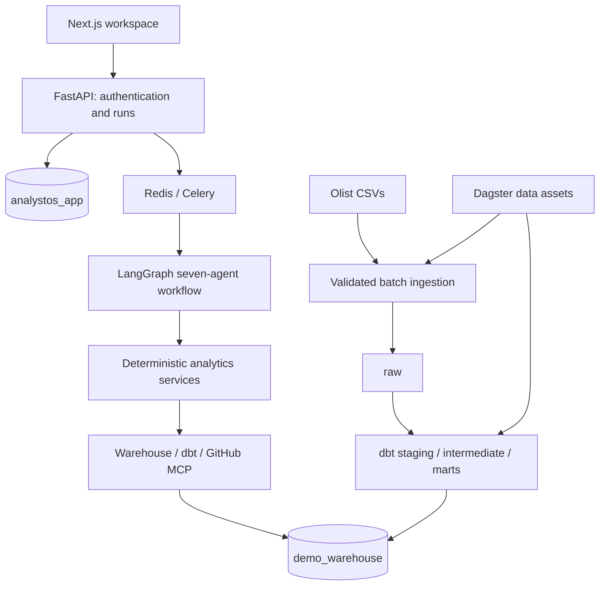

# System architecture

Local PostgreSQL is one server with two independent databases and credentials. The app role owns only application state; the loader/dbt role owns warehouse transformations; analytical tools receive a SELECT-only marts role. A catalog service exposes vetted metadata; agents do not get database credentials.

Application tables will include users, analysis_runs, approvals, audit_logs, evidence and LangGraph checkpoints. Run IDs are UUIDs. Checkpoints and evidence persist independently of the queue. Celery tasks use run IDs as idempotency keys. Queue redelivery must not repeat GitHub writes.

Warehouse ingestion writes batch metadata (source version/hash, row count, start/end, status and logical completeness date) before publishing a successful snapshot. A failed load must not replace the previous good mart snapshot. Dagster orchestrates data assets; LangGraph orchestrates analysis, not ETL.

The feature-oriented directory layout separates entry points, product features and shared infrastructure. Empty directories designate planned ownership only; they do not imply implemented services.

